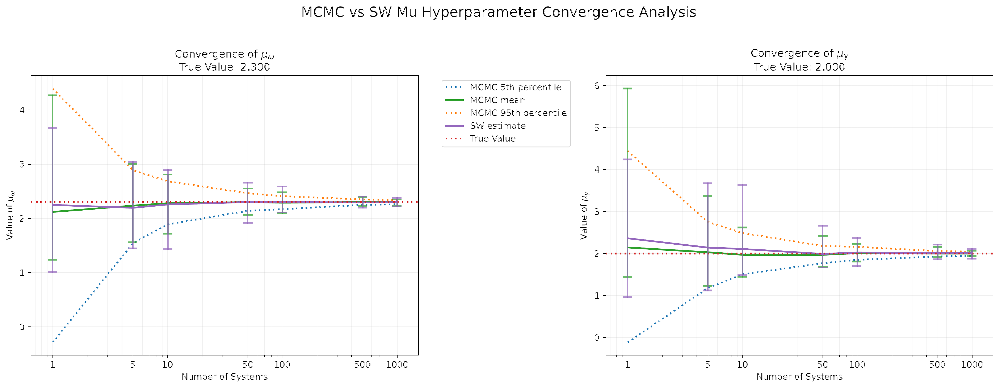
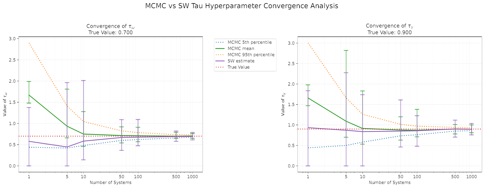
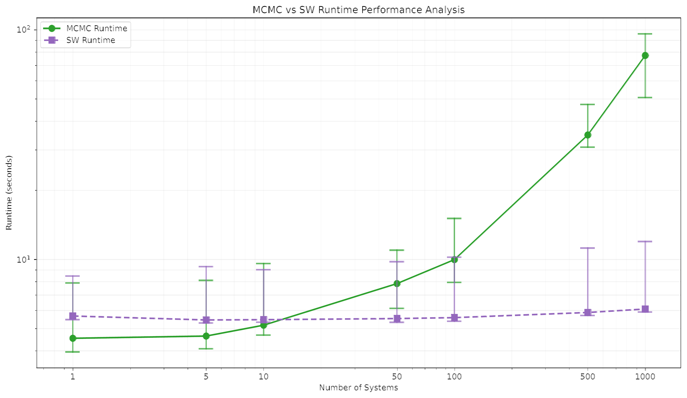

# Masters Project ([Part IIB](https://teaching.eng.cam.ac.uk/content/iib-course-information)) for the MEng in Computer Engineering at the University of Cambridge

- **Title**: Physics-Informed Machine Learning for Populational Inverse Problems  
- **Supervisors**: [Professor Mark Girolami](https://www.eng.cam.ac.uk/profiles/mag92) & [Dr. Arnaud Vadeboncoeur](https://www.eng.cam.ac.uk/profiles/av537)  
- **Grade**: First Class

---

## 🎯 Project Aims

This project looks at methods for estimating population-level parameters from indirect, noisy observations of multiple systems. Two approaches are compared:

1. **[Hierarchical Bayesian Models](https://en.wikipedia.org/wiki/Bayesian_hierarchical_modeling) (HBMs)** uses [Markov Chain Monte Carlo](https://en.wikipedia.org/wiki/Markov_chain_Monte_Carlo) (specifically the No-U-Turn Sampler, a variant of [Hamiltonian Monte Carlo](https://en.wikipedia.org/wiki/Hamiltonian_Monte_Carlo)) to explore the posterior distribution.
2. **Distribution-Matching (DM)** uses gradient descent to minimise a loss based on the Sliced-Wasserstein distance.

---

## Code

All code is written in Python using [JAX](https://jax.readthedocs.io/) for autodiff and JIT-compiled numerics, and [NumPyro](https://num.pyro.ai/) for probabilistic programming. Gradient-based optimisation uses [Optax](https://optax.readthedocs.io/).

| File | Description |
|---|---|
| `code/leapfrog_integrator.py` | JAX-based leapfrog integration for the damped harmonic oscillator and Lotka-Volterra ODEs |
| `code/data_generation.py` | Generates noisy observations from each physical system |
| `code/distributions.py` | Log-posterior, likelihood, and prior distributions for HBM inference |
| `code/sampled_distributions.py` | Sampling utilities for log-normal, normal, and inverse-gamma distributions |
| `code/true_observations.py` | Reads and caches synthetic ground-truth observations |
| `code/push_forward_check.py` | Validates the hierarchical prior push-forward visually |
| `code/run_mcmc.py` | Runs NUTS via NumPyro across population sizes; saves results and chain diagnostics |
| `code/run_sw.py` | Runs the Sliced-Wasserstein distribution-matching method, optimised with Optax |
| `code/analyse_simulation_results.py` | Aggregates results and produces comparison plots across population sizes |

---

## 💡 Main Takeaways

- **Use HBMs when uncertainty matters or when N is small; use DM when speed is essential and N is large.**
- While HBMs provide robust parameter estimation even with small populations, the DM method's performance improves with larger population sizes.
- HBMs become computationally more expensive as population size increases, which is not the case for DM.
- The framework for linear problems (i.e. [damped harmonic oscillator](https://en.wikipedia.org/wiki/Harmonic_oscillator)) generalises well to nonlinear systems (i.e. [Lotka-Volterra equations](https://en.wikipedia.org/wiki/Lotka%E2%80%93Volterra_equations)), though identifiability issues make parameter estimation harder.
- Both methods accurately estimate population means, but struggle more with population variances.

**Mean hyperparameter convergence** — both methods converge to the true value, but MCMC (with uncertainty bands) is more reliable at small N:

**Variance hyperparameter convergence** — variance estimation is harder for both methods, particularly at small population sizes:

**Runtime comparison** — MCMC cost grows sharply with N; the SW method stays flat:

---

## 📄 Resources

- [📊 Presentation (PDF)](presentation.pdf): A high-level summary of methodology and results  
- [📘 Full Report (PDF)](report.pdf): A more complete write-up with theory, methodology, and experiments

---
